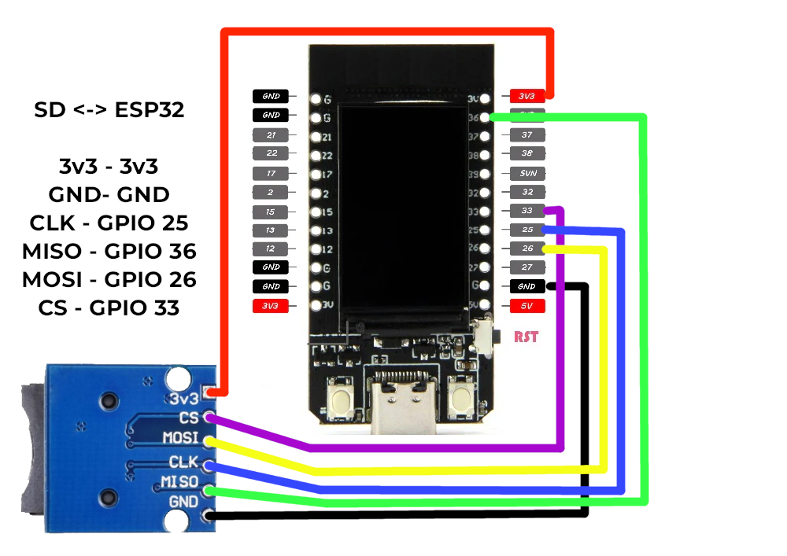

 

  

## ⬆ TTGO T-Display 1.14in Update Highlights 6/10/25 ⬆   Added New v1.7.0!
* Added battery meter (Displayed in volts) for MARAUDER_TTGO_TDISPLAY
* Added deep sleep function (Hold down scroll button 6 seconds) for MARAUDER_TTGO_TDISPLAY
* Adjusted font size on statusbar

## 🐛 Bugs 🐛
* BLE scan will sometimes crash device.
* 
Let me know if you find more.
  

---

📡 TTGO T-Display WiFi Marauder Fork 🚀
A stunning fork of the WiFi Marauder suite, optimized for the TTGO T-Display!
This version introduces exciting new features, bug fixes, and customizations for WiFi/Bluetooth offensive and defensive tasks. Perfect for hobbyists and security enthusiasts!
 
Take your TTGO T-Display to the next level with these powerful updates! Contributions and feedback are welcome. 🎉

---

# 📚 Libraries 📚
You MUST install this version of NimBLE <a href=https://github.com/h2zero/NimBLE-Arduino/releases/tag/1.3.5>NimBLE 1.3.5</a>
 
The other libraries needed can be located <a href=https://github.com/justcallmekoko/ESP32Marauder/wiki/installing-firmware-from-source#installing-firmware-from-source>HERE</a> 

---

# ⚙️ User_Setup Files ⚙️
<a href=https://github.com/ATOMNFT/Marauder-T-display-TTGO/tree/main/User_Setups>THESE</a> files are to be placed in the TFT_eSPI library folder if you plan to compile from the sketch files.
  
Make sure to back up your TFT_eSPI lib folder prior to replacing these files.

---

# SD Wiring Diagram
Here is a simple pic to explain wiring up a micro SD module.

> # 🛠️ **Device Compatibility**
> 
> Successfully tested on:
> - [T-display variant 1](https://a.co/d/aH2SvRw)  
> - [T-display variant 2](https://a.co/d/eFvFgLy)  

# ⚡ **Web Flasher** ⚡
Use the button below to flash with the new web flasher tool!
 

---

<h2>ESP32 Marauder Info</h2>

# ESP32 Marauder

  <b>A suite of WiFi/Bluetooth offensive and defensive tools for the ESP32</b>
    
  
  
  
   
  
  
    
  
   
  

    
# Getting Started
Download the [latest release](https://github.com/justcallmekoko/ESP32Marauder/releases/latest) of the firmware.  

Check out the project [wiki](https://github.com/justcallmekoko/ESP32Marauder/wiki) for a full overview of the ESP32 Marauder

# For Sale Now
You can buy the ESP32 Marauder using [this link](https://www.tindie.com/products/justcallmekoko/esp32-marauder/)

